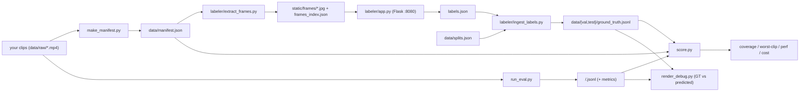

# Benchmark + labeling harness (developer tooling — not part of the installed package)

Bring your own footage, label the action, and score the cropper against those labels for
**coverage**, **smoothness**, **perf**, and **cost** — plus GT-vs-prediction debug videos.

Nothing here ships in the wheel (that's only `src/v_cropper`), and **no datasets, labels,
predictions, or metrics are committed** — the clips we benchmarked are copyrighted broadcast
footage. You supply your own clips; everything downstream runs locally.

## The key idea: scoring never needs the video

The scorer ([`score.py`](score.py)) compares a predicted crop path against human
point-labels using only the manifest's frame counts and dimensions. So once you have
predictions + labels + a manifest, you can re-score with **no video and no API key**. That
makes runs reproducible and lets others verify a metric without your footage.



## Dataset layout (external — never committed)

Point the harness at an external dataset root via `VCROPPER_EVAL_DATA` (or `--data`):

```
<data>/raw/<item>.mp4               your clips (item_id = filename stem)
<data>/splits.json                  {"val": ["1", "2", ...], "test": ["4", "6"]}
<data>/manifest.json                {item_id: {n_frames, fps, width, height}}  (make_manifest.py)
<data>/val/ground_truth.jsonl       {"item_id", "frame_idx", "x", "y"}  (one line per label)
<data>/test/ground_truth.jsonl
```

`item_id` is the clip's filename stem (`raw/2.mp4` → `2`). `frame_idx` is the position in the
**decoded** stream (the same indexing the pipeline and scorer use). `x`/`y` are pixels in the
full-resolution frame.

**You author two things by hand:** `raw/*.mp4` (your clips) and `splits.json` (which clips go in
`val` vs `test`). Everything else — `manifest.json`, the labeling frames, and each split's
`ground_truth.jsonl` — is generated by the steps below.

## Quickstart: benchmark a new sport (end to end)

You can benchmark **any config you can run** — a built-in preset or a custom prompt for a novel
sport — as long as you use the *same* config in both places.

```bash
# Phase 1 — confirm it runs (see the top-level README "Sports & pointing prompts"):
uv run v-cropper game.mp4 --sport hockey            # a built-in preset, OR
uv run v-cropper game.mp4 --prompt-file badminton.txt   # a novel sport (custom prompt)

# Phase 2 — verify it with numbers, reusing the SAME --sport / --prompt(-file):
export VCROPPER_EVAL_DATA=~/vc-bench
mkdir -p "$VCROPPER_EVAL_DATA/raw" && cp your_clips/*.mp4 "$VCROPPER_EVAL_DATA/raw/"
echo '{"val":["clip1","clip2"],"test":["clip3"]}' > "$VCROPPER_EVAL_DATA/splits.json"   # you write this

uv run python eval/make_manifest.py --raw "$VCROPPER_EVAL_DATA/raw" --out "$VCROPPER_EVAL_DATA/manifest.json"
uv run python eval/labeler/extract_frames.py --data "$VCROPPER_EVAL_DATA"
uv run python eval/labeler/app.py --port 8080          # click the action on each frame, then Ctrl-C
uv run python eval/labeler/ingest_labels.py --data "$VCROPPER_EVAL_DATA"
uv run python eval/run_eval.py --split val --sport hockey --out eval/results/hockey   # or --prompt-file
uv run python eval/render_debug.py --split val --pred eval/results/hockey
```

Read `coverage` / `worst-clip` / `structural_ok` from the run summary; the debug video shows exactly
where the crop hits or misses. The per-step reference follows.

## Full workflow

### 1. Manifest — probe your clips

```bash
uv run python eval/make_manifest.py --raw "$VCROPPER_EVAL_DATA/raw" \
  --out "$VCROPPER_EVAL_DATA/manifest.json"
```

The manifest is the authoritative ruler (decode counts + dimensions). `run_eval.py` also
regenerates it into its `--out` dir so scoring can never drift from the environment that
produced the predictions.

### 2. Extract labeling frames (~1/sec)

```bash
uv run python eval/labeler/extract_frames.py --data "$VCROPPER_EVAL_DATA"
```

Writes `eval/labeler/static/frames/<item>__<idx>.jpg` and `eval/labeler/frames_index.json`.

### 3. Label the action (Flask UI)

```bash
uv run python eval/labeler/app.py --port 8080   # open http://127.0.0.1:8080
```

Click the main action (the ball/puck if visible, else the ball-carrier / center of the active
play) on each frame; **Skip** frames with no clear action. Every click is saved to
`eval/labeler/labels.json` immediately, so you can stop and resume anytime.

### 4. Ingest labels → ground truth

```bash
uv run python eval/labeler/ingest_labels.py --data "$VCROPPER_EVAL_DATA"
```

Drops skipped frames, rounds coordinates, routes each label into its split, and writes
`<data>/<split>/ground_truth.jsonl`.

### 5. Run the cropper + score

```bash
# Benchmark the SAME config you ship. Built-in preset:
VCROPPER_EVAL_DATA=/path/to/dataset \
  uv run python eval/run_eval.py --split val --sport hockey --out eval/results/hockey

# A novel sport with a custom prompt (same precedence as the CLI):
VCROPPER_EVAL_DATA=/path/to/dataset \
  uv run python eval/run_eval.py --split val --prompt-file badminton.txt --out eval/results/badminton
```

Writes `<out>/<split>.jsonl` (predictions), `<out>/manifest.json`, and
`<out>/metrics-<split>.json` (coverage, worst-clip, jerk, rtf, `structural_ok`, and a
**perf/cost** block: VLM calls, tokens, estimated cost, wall time). Responses are cached under
`<out>/.cache` (keyed by model + messages + params) so re-runs replay for free; pass
`--no-cache` to force live calls. Match `--model` / `--sport` (or `--prompt` / `--prompt-file`) /
`--send-width` / `--sample-every` / `--spring-k` to the exact config you run in production —
`run_eval.py` resolves the prompt with the same precedence as the CLI
(inline > prompt-file > sport preset > football default), so you measure what you ship.

### 6. Re-score offline (no video, no API key)

```bash
uv run python eval/score.py --pred eval/results/pointing/val.jsonl \
  --truth "$VCROPPER_EVAL_DATA/val/ground_truth.jsonl" --split val \
  --manifest eval/results/pointing/manifest.json --outdir eval/results/pointing/score-val
```

### 7. Debug videos (GT vs prediction)

```bash
VCROPPER_EVAL_DATA=/path/to/dataset \
  uv run python eval/render_debug.py --split val --pred eval/results/pointing
```

Green = ground-truth ideal crop (interpolated between labels); red = the app's crop path; a
flashing cross marks each labeled frame with HIT/MISS per the frozen scorer's rule.

## Metrics

- `primary_metric` — **coverage**: fraction of labeled frames whose action point lands inside a
  *valid* predicted crop window (an out-of-bounds / wrong-aspect window scores as a MISS).
- `guardrail_metric` — **worst-clip** coverage.
- `max_jerk` — mean |third difference| of `x_center`; must stay ≤ `2.0` for `smoothness_ok`.
- `rtf` — processing time ÷ video duration (from the independent manifest).
- `structural_ok` — false if there are constraint violations, path-length mismatches, excess
  jerk, a missing rtf, a missing prediction, or identical paths across items.
- `perf` — `vlm_calls`, `prompt/completion/total_tokens`, `est_cost_usd`, `wall_time_sec`.

Cost uses the same `$/1M`-token envs as the CLI (`VCROPPER_PRICE_IN` / `VCROPPER_PRICE_OUT`,
flash-tier defaults); it's a rough estimate, not a bill.

## Cost / rate-limit note

The NVIDIA free tier is ~40 rpm — keep `--concurrency 1-2` there to avoid 429s. Paid providers
(and the on-disk cache) tolerate the default `--concurrency 8`.

## Files

- `run_eval.py` — runs the pipeline per clip, emits scorer-schema predictions, scores, and
  writes the metrics + perf/cost summary.
- `score.py` — the frozen scorer (vendored Qvest.US, LLC code; attribution in [`../NOTICE`](../NOTICE)).
  Kept byte-identical; also usable as a standalone CLI.
- `make_manifest.py` — probes clips by decoding to build the authoritative manifest.
- `cache.py` — on-disk VLM response cache wrapper (eval-only).
- `render_debug.py` — GT-vs-prediction debug renderer.
- `labeler/extract_frames.py` — samples ~1/sec JPEGs for labeling.
- `labeler/app.py` — Flask click-labeler (requires the `Flask` dev dependency).
- `labeler/ingest_labels.py` — `labels.json` + `splits.json` → per-split `ground_truth.jsonl`.
```
